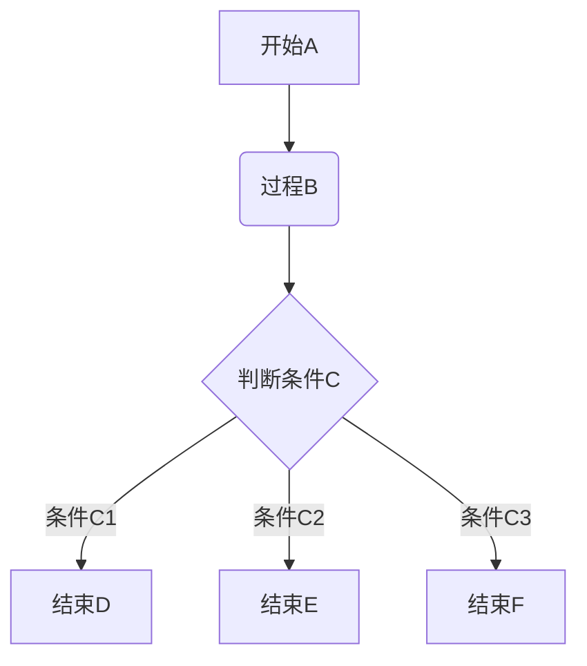
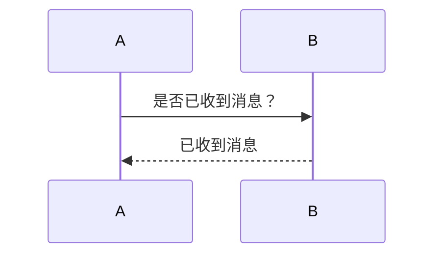
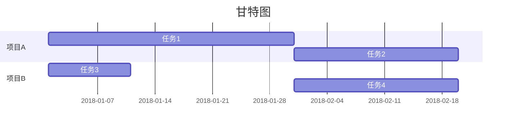

# Markdown_Template
 Markdown 模板

>**<u>参考[菜鸟教程 > Markdown教程](https://www.runoob.com/markdown/md-tutorial.html)部分内容</u>**
>印象笔记中Markdown的**脚注**、**高级链接**功能不可用
[TOC]

# 一级标题
## 二级标题
### 三级标题
#### 四级标题
##### 五级标题
###### 六级标题
段落正常字体
*段落斜体*
**段落粗体**
***段落粗斜体***
***
~~删除线~~
<u>下划线</u>

* 无序项
1. 有序项1
2. 有序项2
3. 有序项3
    1. 嵌套项
    * 嵌套项
    
>区块引用
>>一层嵌套引用
>>>二层嵌套引用
>>>
>>>>>>>>>>>十层嵌套引用.....

`printf("这是一个代码片段"); //代码片段`

```C
printf("这是一个代码块");
//代码块
```

[简单链接格式](https://www.runoob.com/markdown/md-tutorial.html)


| 左对齐         |      居中      |         右对齐 |
| :------------- | :------------: | -------------: |
| 这是一个单元格 | 这是一个单元格 | 这是一个单元格 |
| 这是一个单元格 | 这是一个单元格 | 这是一个单元格 |

\*\*使用转义字符\*\*

```chart
,数值一,数值二,数值三
类型1,5000,8000,4000
类型2,3000,1000,4000
类型3,5000,7000,6000
类型4,7000,2000,3000

type: column
title: 柱状图
x.title: 类型
x.suffix: 单位x
y.title: 数值
y.suffix: 单位y
```

```math
e^{i\pi} + 1 = 0 //(Just English Allow Here)
```






